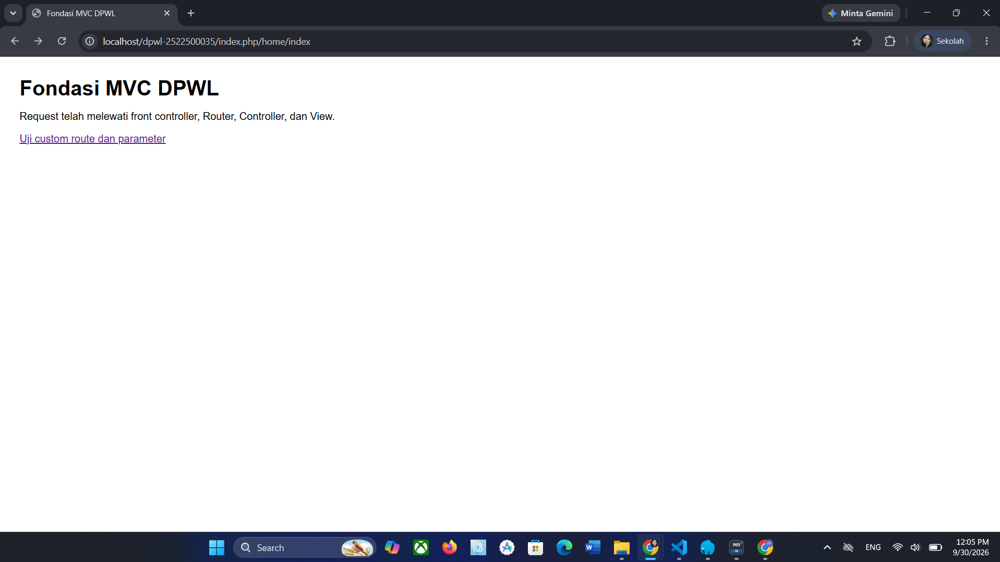
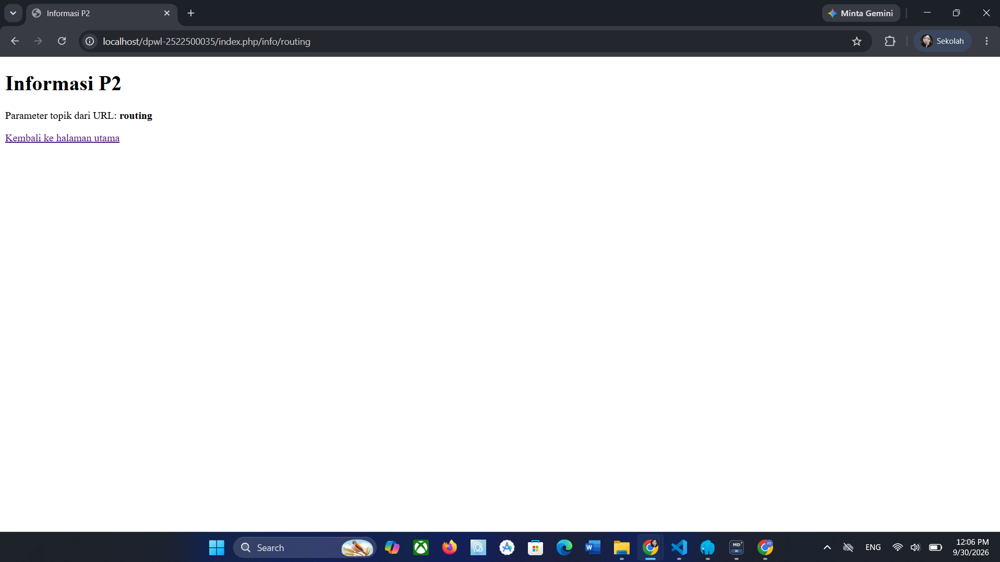

# pertemuan-02
## 1. Tujuan Praktikum
Jawaban : 
Praktikum P2 bertujuan untuk memahami dan menerapkan konsep dasar Model-View-Controller (MVC) pada aplikasi web menggunakan PHP. Pada praktikum ini, dibuat struktur aplikasi yang memisahkan pengelolaan request, routing, controller, dan tampilan sehingga kode program menjadi lebih terstruktur dan mudah dikembangkan.

## 2. Struktur Direktori
```
dpwl-2522500035/
├── application/
│   ├── config/
│   │   ├── config.php
│   │   └── routes.php
│   ├── controllers/
│   │   └── Home.php
│   ├── helpers/
│   │   └── url_helper.php
│   └── views/home
│       ├── index.php
│       └── info.php
│           
├── assets/
│   └── css/
│       └── app.css
├── dokumentasi/
├── system/core
│   ├── Controller.php
│   └── Router.php
│   
└── index.php
```

## 3. Front Controller
Jawaban : 
index.php berperan sebagai front controller, yaitu satu titik masuk utama aplikasi. Setiap request dari browser diarahkan terlebih dahulu ke index.php.

Setelah menerima request, index.php menjalankan komponen aplikasi yang diperlukan, kemudian request diteruskan ke Router untuk menentukan controller dan method yang sesuai.

Dengan adanya front controller, proses request aplikasi menjadi lebih terpusat dan terstruktur.

## 4. Routing dan Pemetaan URL
| URL/Route | Controller | Method | Parameter | View |
|---|---|---|---|---|
| / | Home | index | - | home/index.php |
| home/index | Home | index | - | home/index.php |
| home/info/mvc | Home | info | mvc | home/info.php |
| info/routing | Home | info | routing | home/info.php |
| atm/nasabah | Home | atm | nasabah | home/atm.php |

Penjelasan :
Route atm/nasabah digunakan untuk mengakses fitur ATM dengan konteks nasabah. Route tersebut diarahkan ke Controller Home, kemudian menjalankan method atm dengan parameter nasabah. Selanjutnya, method tersebut menampilkan View home/atm.php yang berisi tampilan atau informasi terkait nasabah pada aplikasi ATM.

## 5. Base URL dan Helper
Jawaban :
base_url() digunakan untuk membentuk URL berdasarkan alamat dasar aplikasi. Helper ini biasanya digunakan untuk memanggil file pendukung seperti CSS, JavaScript, gambar, dan assets lainnya.

Contoh penggunaan untuk memanggil assets/css/app.css:

`<link rel="stylesheet" href="<?= base_url('assets/css/app.css') ?>">`

Sedangkan site_url() digunakan untuk membentuk URL yang mengarah ke route aplikasi.

Contoh penggunaan untuk navigasi:

`<a href="<?= site_url('home/index') ?>">Home</a>`

Perbedaannya adalah:

 - base_url() → digunakan untuk mengakses file atau resource aplikasi.

- site_url() → digunakan untuk membentuk URL menuju route/controller aplikasi.

## 6. Alur Request - Response
Jelaskan dua alur berikut:

1. Alur eksekusi aktual P2:
Browser → index.php → Router → Controller → View → Response.

    Penjelasannya : Pada implementasi P2, alur request-response dimulai ketika pengguna mengakses URL melalui browser. Request tersebut masuk ke index.php sebagai front controller. Selanjutnya, Router menentukan controller dan method yang sesuai berdasarkan route yang diakses. Controller kemudian menjalankan method yang diminta dan memanggil View untuk menampilkan halaman. Setelah itu, hasil dari View dikirim kembali sebagai response kepada browser.

2. Posisi Model dalam arsitektur MVC lengkap:
Browser → index.php → Router → Controller → Model → basis data/data → Model → Controller → View →
Response.
Pada implementasi P2, Model belum digunakan karena akses dan pengelolaan basis data mulai
diimplementasikan pada P3.

    Penjelasan : Dalam arsitektur MVC secara lengkap, Model berperan sebagai bagian yang mengelola data dan berhubungan dengan basis data. Setelah request diterima dan diarahkan oleh Router ke Controller, Controller dapat meminta Model untuk mengambil atau mengolah data. Model kemudian berkomunikasi dengan basis data atau sumber data. Setelah data diperoleh, Model mengembalikannya kepada Controller. Controller selanjutnya meneruskan data tersebut ke View untuk ditampilkan kepada pengguna.

## 7. Hasil Pengujian dan Debugging
Jawaban :
Pada saat proses implementasi P2, terdapat kendala pada bagian **routing**, yaitu munculnya error yang mengarah pada file `Router.php` yang berada di dalam folder `system/core`. Error tersebut membuat proses routing pada aplikasi tidak dapat berjalan dengan baik. Setelah dilakukan pemeriksaan, penyebab error pada `Router.php` belum dapat ditemukan secara pasti karena kode pada bagian tersebut tidak menunjukkan kesalahan yang jelas.

Pada saat itu, proses pengembangan kemudian dilanjutkan ke tahap pembuatan **`index.php`** yang berada di luar folder `application`, `system/core`, dan `asset/css`. File `index.php` tersebut berfungsi sebagai **front controller** dan menjadi titik awal masuknya request ke dalam aplikasi. File ini menghubungkan request dari browser dengan sistem routing dan controller yang terdapat di dalam aplikasi.

Setelah `index.php` selesai dibuat dan dikonfigurasi dengan benar, aplikasi kembali dapat dijalankan dan error routing yang sebelumnya muncul tidak terjadi lagi. Hal ini menunjukkan bahwa permasalahan sebelumnya kemungkinan berkaitan dengan **alur masuk aplikasi atau konfigurasi yang belum lengkap**, sehingga Router belum dapat bekerja sebagaimana mestinya. Dengan adanya `index.php` sebagai satu titik masuk aplikasi, request dari browser dapat diteruskan ke sistem routing, kemudian diarahkan ke controller dan view yang sesuai.

Dengan demikian, kendala tersebut dapat diselesaikan setelah struktur dan alur dasar aplikasi P2 dilengkapi, khususnya dengan adanya `index.php` sebagai **front controller**. Proses ini juga membantu memahami bahwa dalam pola MVC, setiap bagian memiliki fungsi yang saling berhubungan, sehingga konfigurasi atau komponen yang belum lengkap dapat menyebabkan error pada bagian lain yang terlihat seperti sumber masalah.

## 8. Bukti Tangkapan Layar
Sisipkan gambar yang relevan dari folder dokumentasi/ dengan perintah:
### Gambar 1. Hasil Pengujian Halaman Utama

### Gambar 2. Hasil Pengujian Custom Route


## 9. Kesimpulan P2

Pada praktikum P2, kerangka MVC sudah dapat digunakan untuk mengatur alur dasar aplikasi dengan memisahkan proses menjadi beberapa bagian, yaitu **Front Controller, Router, Controller, dan View**. Request dari browser dapat masuk melalui `index.php`, kemudian Router menentukan tujuan request, Controller menjalankan proses sesuai method yang dipanggil, dan View menampilkan hasil kepada pengguna. Dengan adanya struktur tersebut, alur request-response aplikasi menjadi lebih terorganisir dan setiap bagian memiliki tanggung jawab masing-masing.

Pada P2, **Model belum digunakan** karena pengelolaan data dan akses ke basis data belum menjadi bagian dari implementasi. Pada **P3**, kerangka MVC akan dikembangkan dengan menambahkan **Model dan koneksi ke basis data**, sehingga aplikasi dapat melakukan pengelolaan data, seperti mengambil, menambahkan, mengubah, dan menghapus data. Dengan demikian, alur MVC pada P3 akan menjadi lebih lengkap karena Controller dapat berkomunikasi dengan Model untuk mengolah data sebelum meneruskannya ke View.
